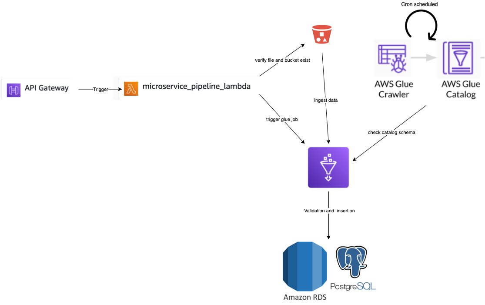
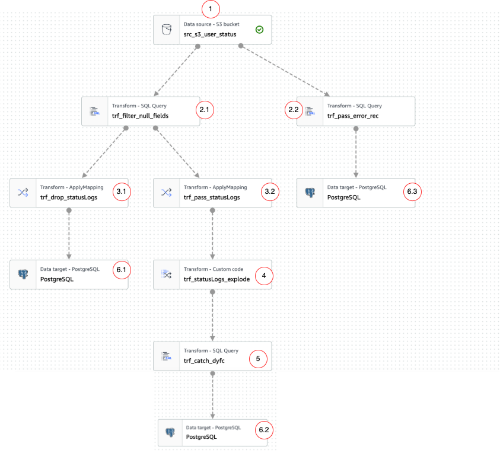
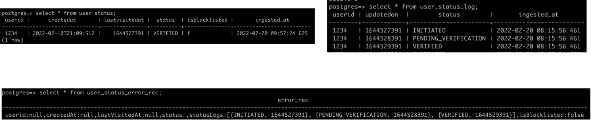

# Microservice Assignment

Services used:
1. API gateway
2. Lambda
3. S3
4. Glue 
5. RDS (postgres)

Following is the architecture of the pipeline:

1. The pipeline starts with client making an API call to the exposed URL with the bucket name and the filename(key). This is API is integrated with the **microservice_pipeline_lambda** lambda to receive the request and send a response back to the client.
2. The lambda parses the request query and queries the **microservice-hw** bucket to determine if the key is present in the bucket. 
   If the bucket and key strings do not point to a valid resource, a 400 response is sent to the client.
   If the information points to a valid resource, a 200 response is sent to the client and the glue job **s3_rds_etl** is triggered.
3. There are 2 glue crawlers which help to keep catalog of the objects in s3 and postgres RDS:
   1. **user_status_crawler**- determines the schema of the files(user_status_xxx.json) in the s3 bucket with the help of json classifier and catalogs them as *table_microservice_hw*.
   2. **postgres_user_status_crawler**- determines schema for postgres tables for user_status storage. 3 catalog tables currently:
        1. postgres_postgres_public_user_status
        2. postgres_postgres_public_user_status_log
        3. postgres_postgres_public_user_status_error_rec
4. The **s3_rds_etl** is a pyspark script (modified over script built via glue studio). The data is then ingested into postgres via JDBC driver into 3 tables namely: **user_status**,**user_status_log** and **user_status_error_rec**.

## Glue ETL Job
The job script is mostly built out of Glue Studio and is modified a bit since some part could not be performed on the studio. Following is the studio diagram for the prototype (before modification) but serves as a good illustration:

### Node briefs
1. s3 bucket node - data source. Takes schema info from catalog table and data from s3 bucket path stored in the crawler properties.
2. Validator SQL node 
   2.1. allows only records with non-null fields
   2.2. allows only records with null fields concatenated as one varchar field. 
3. Mapper node
   3.1. drops statusLogs field since it contains history of activities.
   3.2. passes only statuLogs to feed into the history table.
4. custom transform node(pyspark) - explodes the statusLogs and creates multiple records for each dictionary in the array iterable.
5. SQL node - for catching the DynamicFrame collection spit out by pyspark node.
6. Target nodes
   6.1. - **user_status** - latest status of the user
   6.2. - **user_status_log** - history of activity of the user
   6.3. - **user_status_error_rec** - error records found during validation

